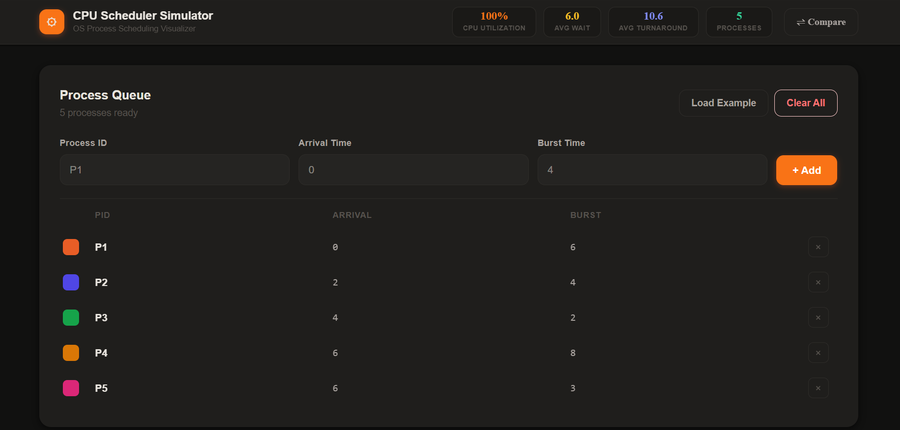
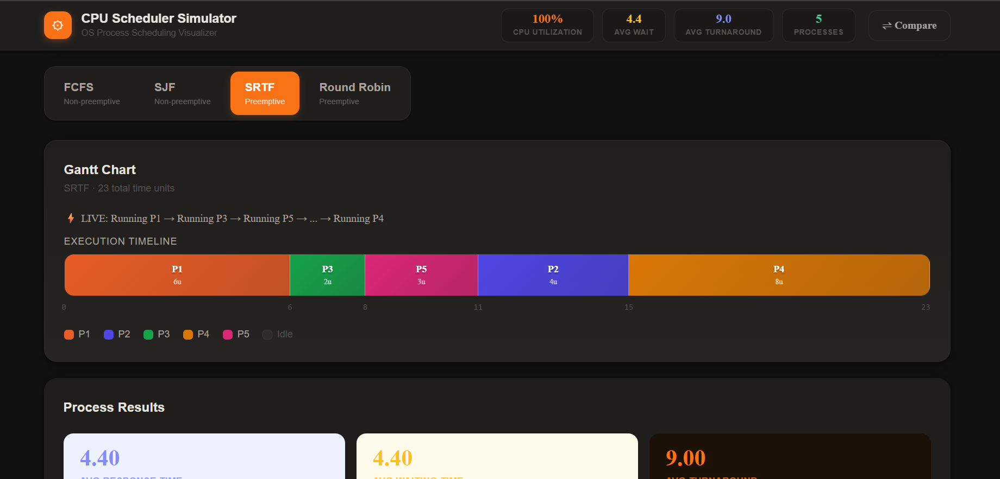
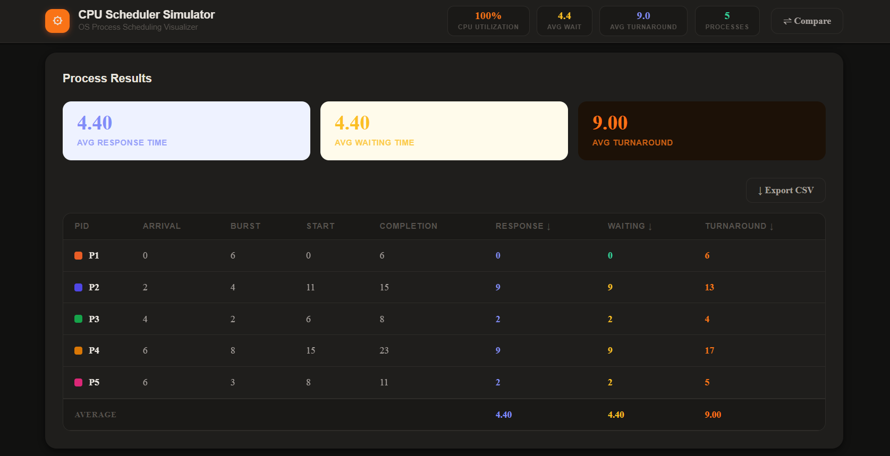
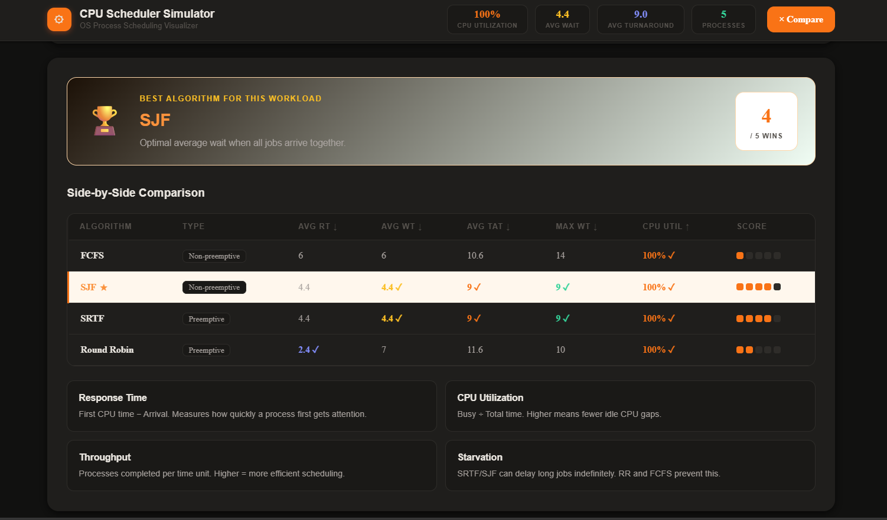

# ⚙️ CPU Scheduler Simulator

An interactive, visual CPU scheduling simulator built with **React + Vite**. Supports four scheduling algorithms with animated Gantt charts, detailed performance metrics, algorithm comparison, and CSV export.

## 🚀 Live Demo
> Coming soon

---

## ✨ Features

- **4 Scheduling Algorithms** — FCFS, SJF, SRTF (Preemptive SJF), Round Robin
- **Animated Gantt Chart** — color-coded processes, idle CPU visualization, time markers
- ⚡**Live Execution Feed** — dynamically shows how CPU switches between processes
- **6 Performance Metrics per process:**
  - Response Time = First CPU Time − Arrival Time
  - Waiting Time = Turnaround − Burst
  - Turnaround Time = Completion − Arrival
  - Start Time, Completion Time
- **Algorithm Comparison Table** — side-by-side: Avg RT, Avg WT, Avg TAT, Max WT, CPU Utilization %, Throughput
- **🏆 Best Algorithm Detection** — automatically identifies the best algorithm for the current workload
- **⚠ Starvation Warning** — flags processes waiting beyond threshold
- **↓ CSV Export** — download results as spreadsheet
- **Edge case handling** — Idle CPU gaps, same arrival times, quantum > burst, single process, tie-breaking

---

## 🧠 How It Works

Each algorithm is simulated independently on the same set of processes.

The simulator:
1. Executes processes step-by-step based on selected algorithm
2. Generates a Gantt chart showing execution order
3. Computes performance metrics
4. Compares all algorithms to determine the best one for the given workload

---

## 📐 Algorithms

| Algorithm | Type | Key Property |
|-----------|------|-------------|
| FCFS | Non-preemptive | In order of arrival. Convoy effect possible. |
| SJF | Non-preemptive | Shortest burst runs next. Optimal avg WT when all arrive together. |
| SRTF | Preemptive | Preempts on every arrival if new job has less remaining time. Minimum avg WT overall. |
| Round Robin | Preemptive | Fixed time quantum. Fair & starvation-free. |

---

## 📊 Metrics Explained

| Metric | Formula | Why It Matters |
|--------|---------|----------------|
| Response Time | First Start − Arrival | How quickly a process *first* gets CPU. Critical for interactive systems. |
| Waiting Time | TAT − Burst | Total time spent waiting in the ready queue. |
| Turnaround Time | Completion − Arrival | Total time from submission to completion. |
| CPU Utilization | Busy Time ÷ Total Time | Efficiency of CPU usage. Higher is better. |
| Throughput | Processes ÷ Total Time | How many processes complete per time unit. |

---

## 📸 Screenshots

### Process Input


### Gantt Chart


### Results Table


### Comparison View


---

## 🛠️ Setup & Run

```bash
git clone https://github.com/YOUR_USERNAME/cpu-scheduler-simulator.git
cd cpu-scheduler-simulator
npm install
npm run dev
```

Open [http://localhost:5173/](http://localhost:5173/)

---

## 📦 Build for Production

```bash
npm run build
# Output → dist/
```

---

## 📁 Project Structure

```
cpu-scheduler-simulator/
├── src/
│   ├── algorithms/
│   │   ├── fcfs.js            # FCFS — First Come First Serve
│   │   ├── sjf.js             # SJF (non-preemptive) + SRTF (preemptive)
│   │   └── roundRobin.js      # Round Robin with configurable quantum
│   ├── components/
│   │   ├── ProcessTable.jsx   # Add/remove processes, load example
│   │   ├── GanttChart.jsx     # Animated Gantt chart renderer
│   │   ├── ResultsTable.jsx   # Per-process metrics + CSV export
│   │   └── ComparisonTable.jsx # All-algorithm comparison + best verdict
│   ├── App.jsx
│   └── main.jsx
├── index.html
└── package.json
```

---

## 🎓 OS Concepts Covered

- CPU burst, arrival time, response time, waiting time, turnaround time
- Preemptive vs non-preemptive scheduling
- Gantt chart visualization and interpretation
- Starvation and fairness trade-offs
- CPU utilization and throughput analysis
- Idle CPU gaps and context switching simulation

---

## 🧑‍💻 Tech Stack

**React 18** · **Vite 6** · **Tailwind CSS v4** · Pure JS scheduling logic

---

## 👩‍💻 Author

**Tanisha Verma**

Built as part of Operating Systems learning and extended into a full interactive visualization tool.

---